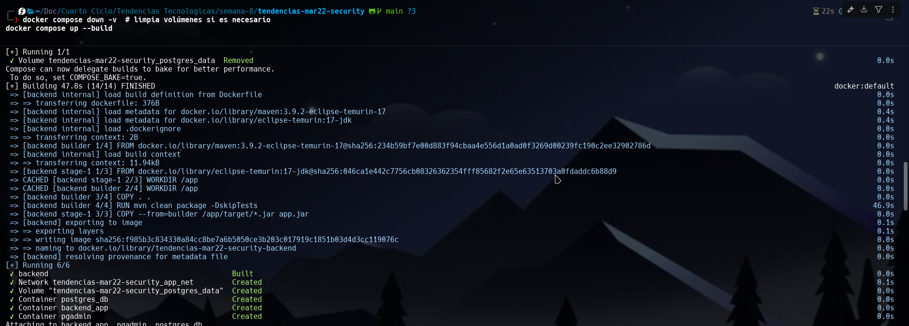
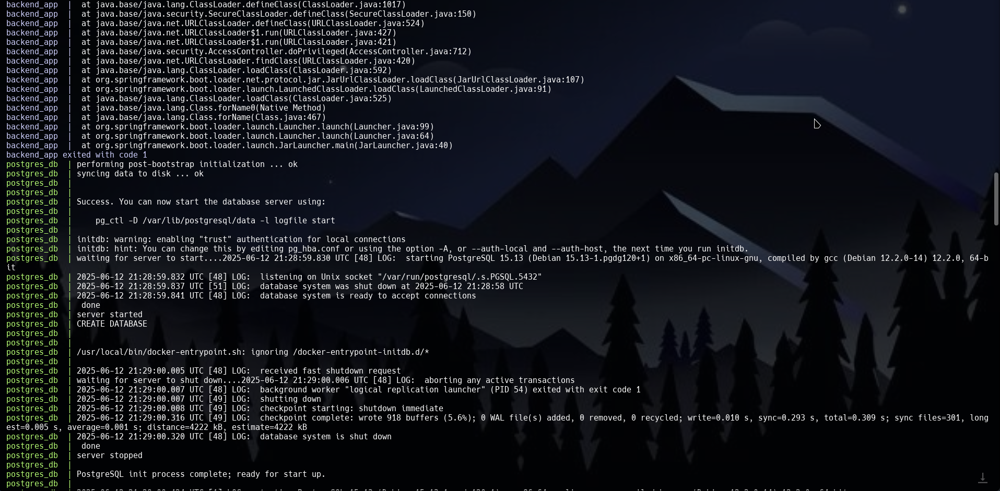
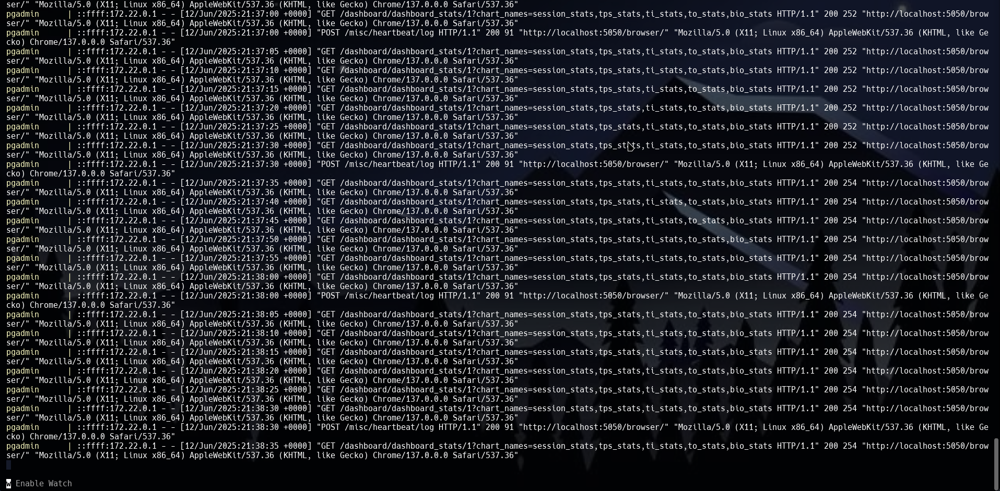
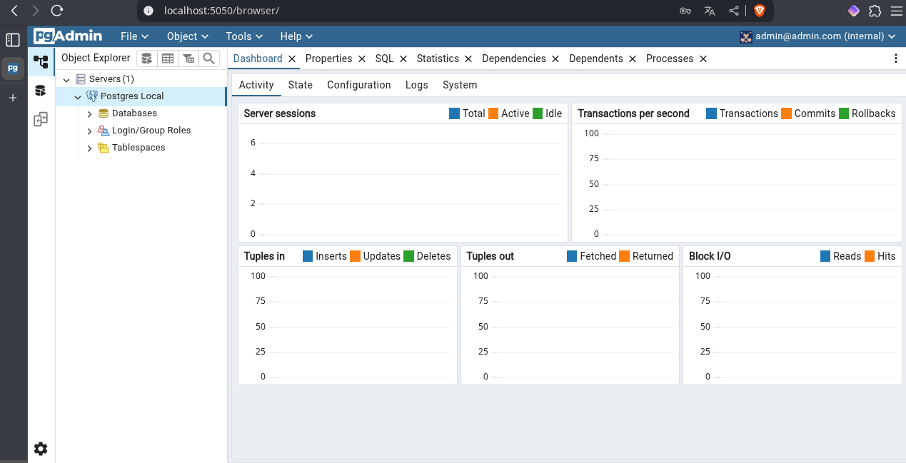
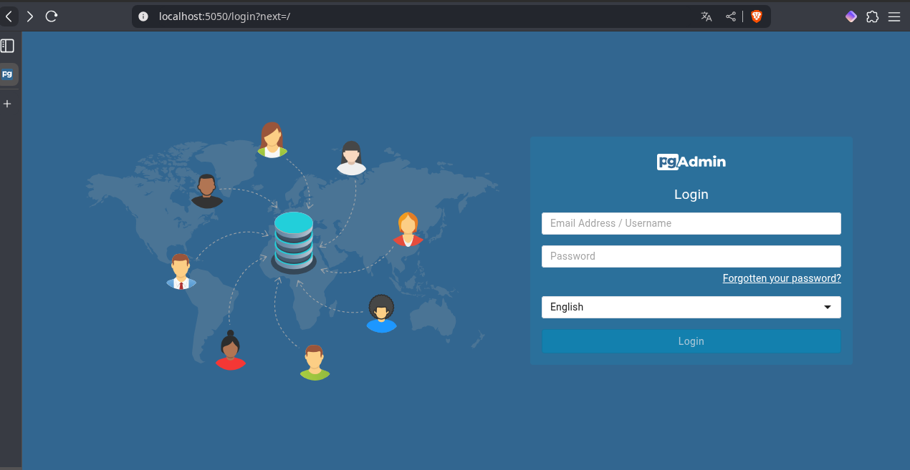

## 1. Título

**Despliegue automatizado de un servidor backend con base de datos PostgreSQL y panel de administración pgAdmin usando Docker y Docker Compose**

## 2. Tiempo de duración

90 minutos

## 3. Fundamentos

El despliegue automatizado de servicios utilizando contenedores ha revolucionado la forma en que se implementan y mantienen aplicaciones en distintos entornos. En esta práctica, se emplea **Docker**, una plataforma de contenedores que permite empaquetar una aplicación con todas sus dependencias, garantizando que se ejecute de manera uniforme sin importar el entorno.

Además, se usa **Docker Compose**, una herramienta que permite definir y correr aplicaciones multicontenedor mediante un archivo YAML. Esta herramienta facilita la orquestación de servicios como bases de datos, aplicaciones backend, y herramientas de administración como **pgAdmin**, de forma sencilla y replicable.

Se crea un servicio de base de datos utilizando la imagen oficial de **PostgreSQL**, lo que asegura un entorno de base de datos robusto, confiable y persistente gracias al uso de volúmenes. A su vez, **pgAdmin** permite una administración gráfica del servidor PostgreSQL, facilitando tareas como consultas SQL, creación de tablas, respaldo de bases de datos, entre otras.

Una técnica clave aplicada en esta práctica es el **multi-stage build**, que permite optimizar el proceso de construcción de imágenes Docker. Esta técnica consiste en separar la etapa de construcción (compilación del código) de la etapa de ejecución, reduciendo significativamente el tamaño de la imagen final, mejorando la eficiencia y la seguridad.

Esta práctica proporciona conocimientos fundamentales para proyectos que requieren despliegue continuo, integración con bases de datos y separación de servicios por responsabilidad.

![Figura 3-1. Arquitectura de servicios en contenedores]

## 4. Conocimientos previos

Para realizar esta práctica el estudiante necesita tener claro los siguientes temas:

- Comandos Linux básicos
- Uso del navegador web
- Fundamentos de redes locales (puertos, IPs, nombres de host)
- Conceptos básicos de Docker (contenedores, imágenes, volúmenes)
- Estructura de archivos `.env`
- Uso básico de PostgreSQL

## 5. Objetivos a alcanzar

- Implementar contenedores para PostgreSQL, pgAdmin y una aplicación backend Java.
- Manipular archivos de configuración como `docker-compose.yml` y `Dockerfile`.
- Utilizar técnicas de construcción multietapa en Docker para optimización.
- Verificar la conectividad entre servicios en una red definida por el usuario.
- Automatizar el despliegue de una aplicación backend con base de datos.

## 6. Equipo necesario

- Computador con sistema operativo Linux (Fedora)
- MSI Nvidia 4060 16GB 512G
- Terminal de comandos (WARP)
- Conexion a Internet
- Navegar web conpatible (Zen browser u otros)
- Docker Engine versión 28.1.1
- Editor de texto (VS Code, nano, etc.)


## 7. Material de apoyo

- [Documentación oficial de Docker](https://docs.docker.com/)
- [Guía del estudiante de la asignatura]
- [Cheat Sheet de comandos de Docker](https://dockerlabs.collabnix.com/docker/cheatsheet/)
- [Documentación oficial de pgAdmin](https://www.pgadmin.org/docs/)

## 8. Procedimiento

**Paso 1:** Clonar el repositorio base del proyecto

```bash
git clone https://github.com/maguaman2/tendencias-mar22-security.git
cd tendencias-mar22-security
```

**Paso 2:** Crear un archivo `.env` con las variables necesarias

```env
POSTGRES_USER=admin
POSTGRES_PASSWORD=admin123
POSTGRES_DB=securitydb
PGADMIN_DEFAULT_EMAIL=admin@admin.com
PGADMIN_DEFAULT_PASSWORD=admin123
DB_PORT=5432
PGADMIN_PORT=5050
BACKEND_PORT=8080
```

**Paso 3:** Crear el archivo `docker-compose.yml` para definir los servicios

![Figura 8-1. Definición de servicios en Docker Compose]

**Paso 4:** Crear el `Dockerfile` en el directorio `backend/` usando multi-stage

![Figura 8-2. Estructura de Dockerfile multietapa]

**Paso 5:** Construir e iniciar los servicios

```bash
docker-compose up --build
```

**Paso 6:** Verificar que todos los contenedores están corriendo

```bash
docker ps
```

**Paso 7:** Acceder a pgAdmin desde el navegador

```text
http://localhost:5050
```

Ingresar las credenciales y conectar al servidor PostgreSQL.

**Paso 8:** Verificar que la aplicación backend está corriendo

```text
http://localhost:8080
```

## 9. Resultados esperados

Al finalizar la práctica, se espera tener:

- Una base de datos PostgreSQL corriendo en un contenedor persistente.
- Acceso gráfico a la base de datos mediante pgAdmin.
- Una aplicación backend corriendo en otro contenedor y conectada a la base de datos.
- Logs del backend mostrando la conexión exitosa con PostgreSQL.

![Figura 9-1. pgAdmin conectado a PostgreSQL]

![Figura 9-2. Aplicación backend ejecutándose]

## Resumen en formato audio
[Escuchar resumen](https://drive.google.com/file/d/1EFDJxd2Wh4_4jqU_4cN83oE8W9KD5ShM/view?usp=sharing)

## 10. Bibliografía

- Docker Inc. (2024). *Docker Documentation*. https://docs.docker.com/
- PostgreSQL Global Development Group. (2024). *PostgreSQL Documentation*. https://www.postgresql.org/docs/
- dpage. (2024). *pgAdmin 4 Documentation*. https://www.pgadmin.org/docs/
- Martínez, L. (2022). *Contenedores para backend en Java*. Editorial OpenSource Press.
