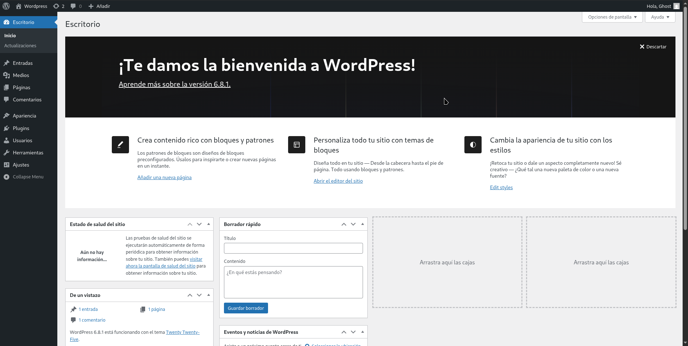
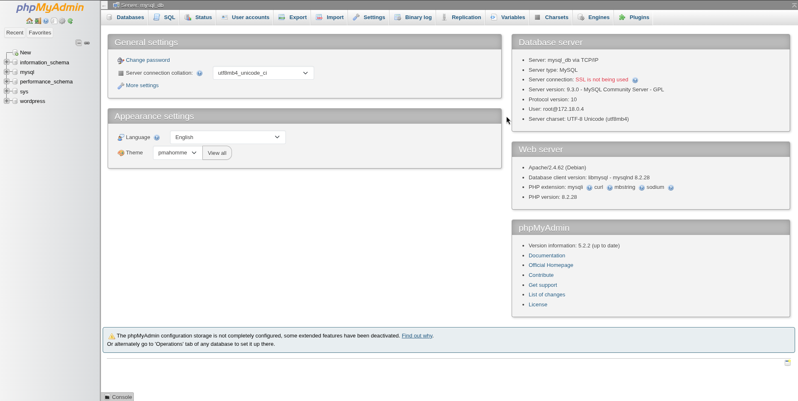

# Implementación de WordPress, MySQL y phpMyAdmin con Docker

## 1. Título

**Implementación de WordPress, MySQL y phpMyAdmin con Docker**

## 2. Tiempo de duración

**60 minutos**

## 3. Fundamentos

Docker permite ejecutar aplicaciones en contenedores aislados, facilitando su despliegue, portabilidad y mantenimiento. Para que los datos persistan incluso después de eliminar o reiniciar contenedores, se utilizan:

- **Volúmenes:** almacenamiento persistente en el sistema host.
- **Redes:** comunicación segura entre contenedores.

En esta práctica se desplegaron los siguientes servicios:

- **MySQL** como motor de base de datos.
- **phpMyAdmin** como cliente visual de administración de MySQL.
- **WordPress** como CMS conectado a MySQL.

### Figura 1-1. Arquitectura de WordPress con Docker


## 4. Conocimientos previos

- Uso básico de Docker (`run`, `volume`, `network`, `logs`, `ps`).
- Fundamentos de redes y puertos.
- Interacción con servicios web en el navegador.
- Comandos de terminal en Fedora Linux.

## 5. Objetivos a alcanzar

- Crear una red Docker personalizada.
- Implementar volúmenes para almacenamiento persistente.
- Ejecutar contenedores de WordPress, MySQL y phpMyAdmin.
- Verificar que los servicios se comuniquen correctamente.
- Comprobar que los datos persisten tras reiniciar los contenedores.

## 6. Equipo necesario

- Computadora con Docker instalado.
- Terminal de comandos (Warp u otro).
- Navegador web (Zen Browser o similar).
- Conexión a Internet estable.

## 7. Material de apoyo

- Documentación oficial de Docker.
- Docker Hub para WordPress, MySQL y phpMyAdmin.
- Guías de redes y volúmenes en Docker.

---

## 8. Procedimiento

### Paso 1: Crear red Docker personalizada

```bash
docker network create ghost
```
### Paso 2: Crear volúmenes para persistencia
```bash
docker volume create wp_data
docker volume create mysql_data
```
### Paso 3: Ejecutar contenedor MySQL
``` bash
docker run -d --name mysql_db \
  --network ghost \
  -v mysql_data:/var/lib/mysql \
  -e MYSQL_ROOT_PASSWORD=123456 \
  -e MYSQL_DATABASE=wordpress \
  mysql:latest
```
### Paso 4: Ejecutar phpMyAdmin
```bash
docker run -d --name phpmyadmin \
  --network ghost \
  -e PMA_HOST=mysql_db \
  -p 8082:80 \
  phpmyadmin:latest
```
### Paso 5: Ejecutar WordPress
```bash
docker run -d --name wordpress \
  --network ghost \
  -v wp_data:/var/www/html \
  -e WORDPRESS_DB_HOST=mysql_db \
  -e WORDPRESS_DB_USER=root \
  -e WORDPRESS_DB_PASSWORD=123456 \
  -e WORDPRESS_DB_NAME=wordpress \
  -p 81:80 \
  wordpress:latest
```
### Paso 6: Acceder a los servicios

    WordPress: http://localhost

    phpMyAdmin: http://localhost:8082

### 9.Resultados Esperados
Resultado de la pagina de wordpres funcionando correctamente


Pagina de phpmyadmin funcionando correctamente



### Resultados
La implementación de WordPress, MySQL y phpMyAdmin mediante Docker demostró ser una solución eficiente y modular para desplegar un entorno completo de desarrollo web. Gracias al uso de contenedores y volúmenes, se logró asegurar la persistencia de los datos incluso tras reinicios o eliminación de contenedores. La red personalizada permitió que los servicios se comunicaran de manera segura y efectiva, mientras que phpMyAdmin facilitó la administración de la base de datos de forma gráfica.
Este enfoque no solo simplifica el proceso de instalación y configuración de herramientas como WordPress, sino que también promueve buenas prácticas de despliegue aislado y replicable, lo que lo convierte en una excelente opción para entornos educativos, pruebas o desarrollo profesional.

[Escuchar resumen]
 - Formato Audio
 https://drive.google.com/file/d/1ueTqDHbYnZMV9B0fdJU2d7wsquILMaB9/view?usp=drive_link


### 10. Bibliografía
Docker Inc. (2023). Docker Documentation. https://docs.docker.com

WordPress.org (2023). WordPress with Docker. https://wordpress.org

Red Hat. ¿Qué es Docker?. https://www.redhat.com/es/topics/containers/what-is-docker

phpMyAdmin. Docker Hub. https://hub.docker.com/r/phpmyadmin/phpmyadmin
