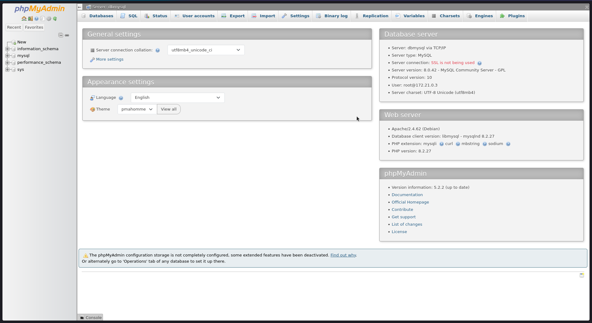
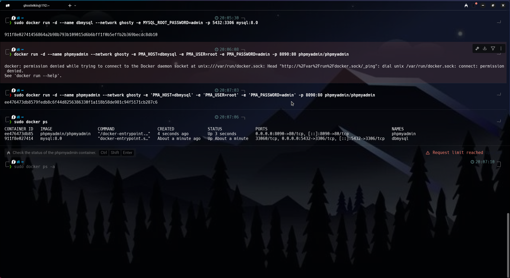

#  Implementación de MySQL y phpMyAdmin en Docker usando red personalizada `ghosty`

---

## 1. Título
Persistencia de Datos en Contenedores Docker con MySQL y Administración con phpMyAdmin

---

## 2. Duración
30 minutos

---

## 3. Fundamentos
Un contenedor Docker es una unidad de software que encapsula una aplicación y todas sus dependencias para ejecutarse de forma consistente en cualquier entorno.

#### Comunicación entre contenedores:
Docker permite conectar múltiples contenedores mediante redes personalizadas, facilitando la comunicación segura entre aplicaciones y servicios.

#### MySQL:
Sistema de gestión de bases de datos relacional ampliamente usado. Dentro de un contenedor, se requiere configurar usuarios, contraseñas y puertos para su acceso externo.

#### phpMyAdmin:
Herramienta de administración visual para MySQL, que permite gestionar bases de datos, tablas y registros mediante una interfaz web amigable.

### Arquitectura de contenedores MySQL + phpMyAdmin en red `ghosty`


---

## 4. Conocimientos previos
- Comandos básicos de Docker (`docker run`, `docker network create`, `docker ps`).
- Conceptos de redes Docker (bridge, personalizada).
- Fundamentos básicos de bases de datos MySQL.
- Navegación web para acceso a phpMyAdmin.

---

## 5. Objetivos a alcanzar
1. Crear una red personalizada en Docker llamada `ghosty`.
2. Implementar contenedores de MySQL y phpMyAdmin conectados entre sí.
3. Acceder a phpMyAdmin mediante navegador y administrar la base de datos MySQL.
4. Verificar comunicación correcta entre servicios.

---

## 6. Equipo necesario
- Computadora con Docker instalado.
- Terminal de comandos (Warp u otro).
- Navegador web (Zen Browser o similar).
- Conexión a Internet estable.

---

## 7. Material de Apoyo
- [Documentación oficial de Docker](https://docs.docker.com/)
- [Documentación oficial de MySQL](https://dev.mysql.com/doc/)
- [Guía de phpMyAdmin](https://docs.phpmyadmin.net/)
- Video tutoriales sobre redes personalizadas y contenedores en Docker.

---

## 8. Proceso de creación

### 8.1 Crear una red personalizada `ghosty`
```bash
docker network create --attachable ghosty
```

### 8.2 Crear el contenedor de MySQL
```bash
docker run -d --name dbmysql --network ghosty -e MYSQL_ROOT_PASSWORD=admin -p 5432:3306 mysql:8.0
```
### 8.3 Crear el contenedor de phpMyAdmin
``` bash
docker run -d --name phpmyadmin --network ghosty -e PMA_HOST=dbmysql -e PMA_USER=escarriel@sudamericano.edu.ec -e PMA_PASSWORD=admin -p 8090:80  phpmyadmin/phpmyadmin

```
### 8.4 Verificar los contenedores activos
```
docker ps
```

### 9.Resultados esperados

Contenedor MySQL en ejecución accesible en el puerto 5432.

Contenedor phpMyAdmin en ejecución accesible en http://localhost:8090.

Comunicación exitosa entre phpMyAdmin y MySQL usando la red ghosty.

Posibilidad de crear, consultar y modificar bases de datos de forma gráfica.



### 10. Visualización de Warp con todos los comandos utilizados



Durante el desarrollo de esta práctica, se logró implementar de manera correcta la arquitectura de comunicación entre contenedores utilizando una red Docker personalizada. Se verificó que phpMyAdmin se conecta exitosamente a MySQL, permitiendo operaciones de gestión de bases de datos a través de la web, todo de forma aislada y segura gracias a Docker.

[Escuchar resumen]
 - Formato Audio
 https://drive.google.com/file/d/12UtLCUCfGGse-h9nXvFwJqTChQ-2BxX8/view?usp=sharing

### 11. Bibliografía
Docker Inc. (2024). Documentación oficial de Docker(https://docs.docker.com/)

MySQL (2024). MySQL 8.0 Documentation(https://dev.mysql.com/doc/)

phpMyAdmin (2024). phpMyAdmin Official Documentation(https://docs.phpmyadmin.net/)
