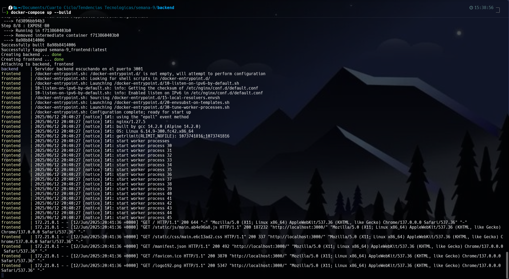
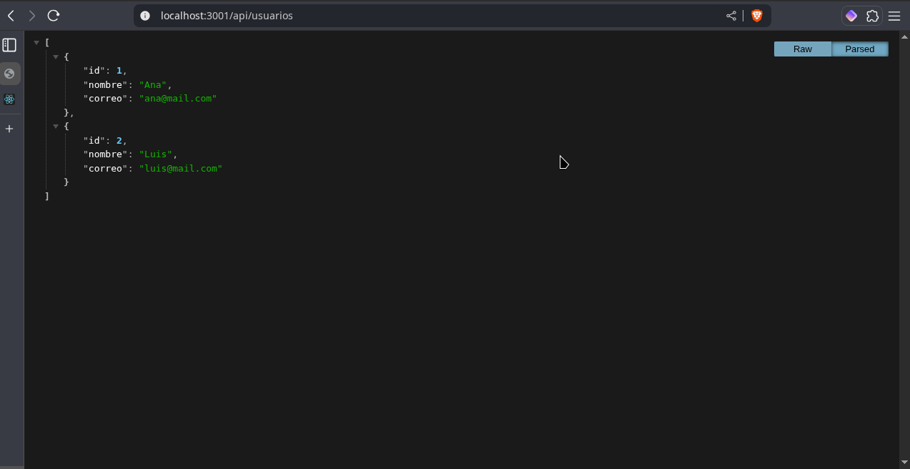

# Practica servidor web

## 1. Titulo

Contenerización de aplicación React frontend con tabla de datos obtenidos desde API backend en Node.js usando Docker y Docker Compose

## 2. Tiempo de duración

120 minutos

## 3. Fundamentos

En esta práctica se aplican varios conceptos importantes relacionados con el desarrollo y despliegue de aplicaciones web modernas mediante contenerización. Primero, se trabaja con **Node.js** y **Express**, tecnologías ampliamente usadas para construir APIs REST, que permiten a los clientes (como aplicaciones frontend) obtener y manipular datos a través de endpoints HTTP.

El frontend se desarrolla con **React**, una biblioteca JavaScript para construir interfaces de usuario dinámicas y reactivas. React permite la actualización eficiente de componentes, como tablas, cuando los datos cambian. La aplicación frontend consume los datos de la API y los muestra en una tabla en tiempo real.

Para facilitar el despliegue y la portabilidad, se utilizan **contenedores Docker**, que empaquetan la aplicación junto con sus dependencias y configuración en una unidad ligera y reproducible. Cada componente (backend y frontend) se contiene por separado para aislar su entorno y facilitar su administración.

El orquestador **Docker Compose** permite definir y administrar múltiples contenedores que forman la aplicación completa. Esto incluye crear una red privada para que frontend y backend se comuniquen mediante nombres de servicio (`backend`), evitando problemas de configuración IP. Así se asegura que la aplicación frontend pueda consumir la API sin problemas.

Además, la práctica considera aspectos como el uso de **CORS** para permitir solicitudes cross-origin desde el frontend al backend, y la creación de imágenes Docker basadas en node y nginx para producción.

![Figura 3-1. Diagrama de arquitectura con frontend y backend en contenedores Docker]

## 4. Conocimientos previos.

Para realizar esta práctica el estudiante necesita tener claro los siguientes temas:

- Comandos básicos de Linux
- Manejo básico de navegador web
- Fundamentos de JavaScript y React
- Conceptos básicos de Node.js y Express
- Conocimiento básico de Docker y Docker Compose
- Uso de terminal o consola de comandos

## 5. Objetivos a alcanzar

- Implementar contenedores Docker para aplicaciones frontend y backend.
- Configurar comunicación entre contenedores mediante Docker Compose.
- Construir una API REST básica con Node.js y Express.
- Desarrollar una interfaz React que consuma y muestre datos de la API.
- Levantar y probar la solución completa localmente usando Docker Compose.

## 6. Equipo necesario

- Computador con sistema operativo Linux (Fedora)
- MSI Nvidia 4060 16GB 512G
- Terminal de comandos (WARP)
- Conexion a Internet
- Navegar web conpatible (Zen browser u otros)
- Docker Engine versión 28.1.1
- Editor de texto (VS Code, nano, etc.)

## 7. Material de apoyo.

- [Documentación oficial de Docker](https://docs.docker.com/)
- [Guía oficial de React](https://reactjs.org/docs/getting-started.html)
- [Express.js Guide](https://expressjs.com/)
- Linux Command Cheat Sheet

## 8. Procedimiento

**Paso 1:** Crear estructura inicial del proyecto con carpetas `backend` y `frontend`.

**Paso 2:** Implementar backend con Node.js y Express, crear API REST con endpoint `/api/usuarios`. Crear `Dockerfile` para contenerizar el backend.

**Paso 3:** Crear frontend con React (`create-react-app`), modificar `App.js` para consumir API y mostrar datos en tabla. Crear `Dockerfile` para producción con nginx.

**Paso 4:** Configurar `docker-compose.yml` para orquestar backend y frontend en contenedores separados con red común.

**Paso 5:** Ejecutar `docker-compose up --build` para construir y levantar contenedores.

**Paso 6:** Acceder a `http://localhost:3000` para visualizar la tabla con datos obtenidos desde el backend.

![Figura 8-1. Ejecución de Docker Compose levantando frontend y backend]

*Figura 8-1. Terminal mostrando el arranque de servicios con Docker Compose*

## 9. Resultados esperados:

- Al abrir el navegador en `http://localhost:3000`, se visualiza una tabla con los usuarios (id, nombre, correo) obtenidos de la API backend.
- Backend responde correctamente al endpoint `/api/usuarios` con JSON de usuarios.
- Ambos contenedores se comunican sin errores, y el frontend muestra datos dinámicos.
- No se presentan errores en consola del navegador ni en logs de Docker.

![Figura 9-1. Tabla de usuarios renderizada en React frontend]

*Figura 9-1. Vista de tabla con datos desde API en la aplicación React*

## Resumen en formato audio
[Escuchar resumen](https://drive.google.com/file/d/1nD8QpGrtjX_GWF74VKexwONrcA4BEhsH/view?usp=sharing)

## 10. Bibliografía

- Merkel, D. (2014). *Docker: lightweight Linux containers for consistent development and deployment*. Linux Journal, (239), 2.
- Flanagan, D. (2020). *JavaScript: The Definitive Guide*. O'Reilly Media.
- Richards, J. (2018). *Learning React: Functional Web Development with React and Redux*. O'Reilly Media.
- Express. (n.d.). *Express - Node.js web application framework*. https://expressjs.com/
- React. (n.d.). *React – A JavaScript library for building user interfaces*. https://reactjs.org/
- Docker Documentation. (n.d.). https://docs.docker.com/
