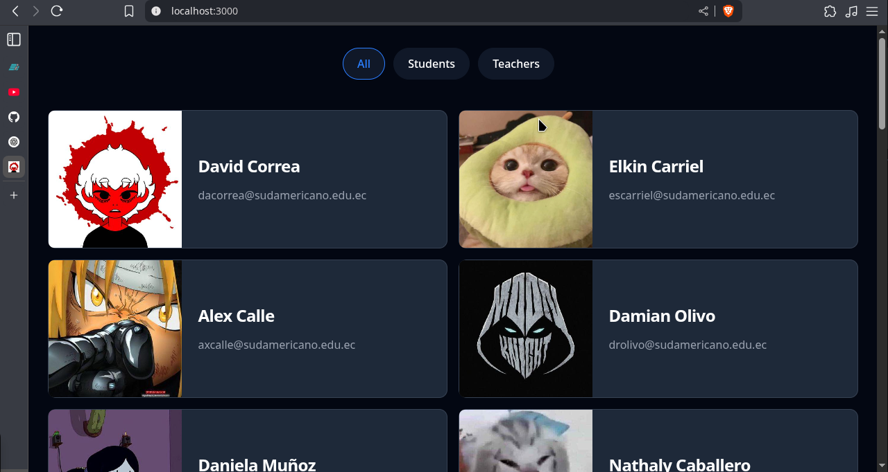
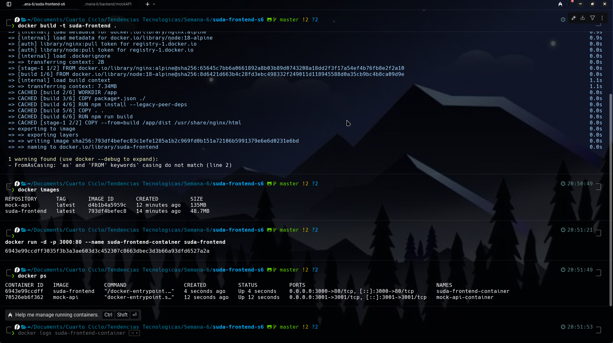
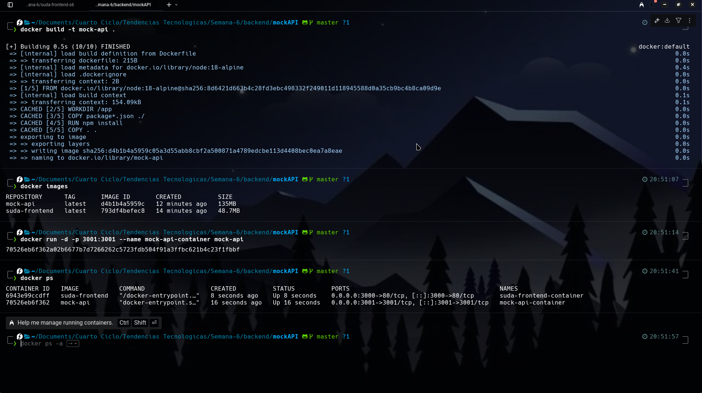

## **1. Título**
**Construcción de imagen Docker personalizada para aplicación React**

## **2. Tiempo de Duración**
**120 minutos estimados**

---

## **3. Fundamentos**
Este ejercicio tiene como propósito principal demostrar cómo contenerizar una aplicación frontend desarrollada en React (con Vite como herramienta de construcción), complementándola con un backend ficticio proporcionado por una API simulada.

Los elementos principales son:
- **Aplicación de cliente**: Proyecto React empaquetado dentro de una imagen Docker.
- **API simulada**: Backend ficticio que entrega datos necesarios al cliente.
- **Puertos usados**: El cliente se sirve en el puerto `3000`, mientras que el backend escucha en `3001`.

Se trabaja sin utilizar `docker-compose`, lo cual exige ejecutar y administrar los contenedores de forma independiente mediante comandos manuales.

---

## **4. Conocimientos Previos**
- Familiaridad con operaciones básicas de Docker (`docker build`, `docker run`, `docker ps`).
- Entendimiento sobre variables de entorno en entornos frontend.
- Experiencia básica con Git para clonar y manejar repositorios.

---

## **5. Objetivos Alcanzados**
- Descargar el repositorio del frontend y realizar pruebas en entorno local.
- Redactar y aplicar un `Dockerfile` para empaquetar el frontend.
- Generar la imagen e instanciar el contenedor correspondiente.
- Construir la imagen del servicio backend y ejecutarlo como contenedor.
- Confirmar que ambos componentes interactúan correctamente.

---

## **6. Equipo Utilizado**
- Computador con sistema operativo Linux (Fedora)
- MSI Nvidia 4060 16GB 512G
- Terminal de comandos (WARP)
- Conexion a Internet
- Navegar web conpatible (Zen browser u otros)
- Docker Engine versión 28.1.1
- Editor de texto (VS Code, nano, etc.)

---

## **7. Material de Apoyo**
- Código del frontend: [Repositorio suda-frontend-s6](https://github.com/Daviddotcoms/suda-frontend-s6)
- Código del backend simulado: [Repositorio mockAPI](https://github.com/Daviddotcoms/mockAPI)
- Referencias técnicas consultadas:
  - [Manual oficial de Docker](https://docs.docker.com/)
  - [Sitio de documentación de Vite](https://vitejs.dev/)

---

## **8. Procedimiento**

### Paso 1: Obtener y acceder al código fuente del cliente

```bash
git clone https://github.com/Daviddotcoms/suda-frontend-s6.git
cd suda-frontend-s6
```
### Paso 2: Ejecutar el proyecto localmente

```bash
# Instalar Node.js y npm
sudo dnf install nodejs npm

# Verificar las versiones instaladas
node --v
npm --v
```

Instalar las dependencias respectivas de cada proyecto:
```bash
npm install
```
En un segundo terminal, configurar el backend simulado:

```bash
git clone https://github.com/Daviddotcoms/mockAPI.git
cd mockAPI
npm install
npm start
```
Volver al terminal del cliente y lanzar la aplicación:
```bash
npm run dev
```
Confirmar funcionalidad accediendo a http://localhost:3000.

### Paso 3: Crear el archivo Dockerfile del cliente
```bash
nano Dockerfile
```
```zsh

# Usa la imagen oficial de Node como base
FROM node:18-alpine as build

# Establece el directorio de trabajo
WORKDIR /app

# Copia los archivos de configuración del proyecto
COPY package*.json ./

# Instala las dependencias
RUN npm install

# Copia el resto de los archivos del proyecto
COPY . .

# Construye la aplicación para producción
RUN npm run build

# Usa Nginx para servir la aplicación
FROM nginx:alpine

# Copia los archivos construidos al directorio de Nginx
COPY --from=build /app/build /usr/share/nginx/html

# Expone el puerto 80
EXPOSE 80

# Comando para iniciar Nginx
CMD ["nginx", "-g", "daemon off;"]
```
### Paso 4: Construir la imagen del cliente
```bash
docker build -t suda-frontend .
docker images
```
### Paso 5: Contenerizar el backend y desplegar ambos servicios

Crear Dockerfile para mockAPI:
```bash
cd mockAPI
nano Dockerfile
```
```bash
FROM node:18-alpine

WORKDIR /app

COPY package*.json ./

RUN npm install

COPY . .

EXPOSE 3001

CMD ["npm", "start"]
```
Construir y ejecutar contenedor:
```bash
docker build -t mock-api .
docker run -d -p 3001:3001 --name mock-api-container mock-api
```
Ejecutar contenedor del cliente:
```bash
docker build -t suda-frontend .
docker run -d -p 80:80 --name suda-frontend-container suda-frontend
```
Verificar los contenedores activos:
```bash
docker ps
```
### 9. Resultados Esperados

Frontend operativo desde el navegador en localhost:3000.

Backend funcional recibiendo y respondiendo en localhost:3001.

Comunicación exitosa entre ambos contenedores (intercambio de datos).
```bash
docker ps
```




 [Escuchar resumen](https://drive.google.com/file/d/17XPWoMY0QWo69kp63ZISdUbYqS0vBV_k/view?usp=sharing)

 ## **11. Bibliografía**
 - Docker Documentation. (2023). *Best practices for writing Dockerfiles*.
 - Vite.js. (2023). *Guía de configuración para producción*.

 ---
