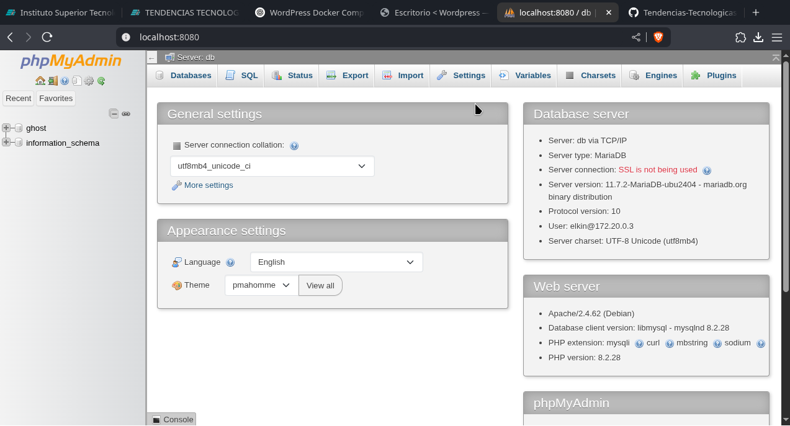
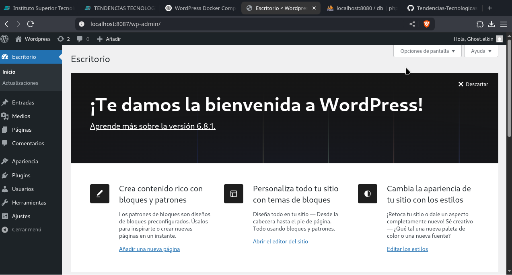

# Práctica servidor web

## 1. Título
Implementación de WordPress con base de datos MariaDB y administración con phpMyAdmin usando Docker Compose

## 2. Tiempo de duración
120 minutos

## 3. Fundamentos

En esta práctica se utilizan contenedores Docker para implementar un entorno completo de servidor web basado en WordPress, con MariaDB como sistema gestor de bases de datos y phpMyAdmin como interfaz gráfica de administración.

**Docker** es una plataforma que permite empaquetar software en contenedores: unidades ligeras, portables y autosuficientes que contienen todo lo necesario para ejecutar una aplicación. En este caso, se emplea Docker Compose, una herramienta para definir y correr aplicaciones multicontenedor, mediante un archivo `docker-compose.yml`.

**WordPress** es un sistema de gestión de contenidos (CMS) ampliamente usado para la creación de sitios web. Para funcionar necesita una base de datos, y en esta práctica se usa **MariaDB**, una bifurcación del sistema MySQL. Por su parte, **phpMyAdmin** permite acceder y administrar dicha base de datos desde el navegador, sin necesidad de usar la línea de comandos.

Los contenedores se conectan a través de una red virtual definida en Docker. También se utilizan volúmenes persistentes para almacenar los datos de WordPress y MariaDB, de modo que no se pierdan al reiniciar los contenedores.


## 4. Conocimientos previos

- Comandos básicos de Linux
- Uso de terminal
- Manejo de navegadores web
- Fundamentos de contenedores
- Conceptos básicos de redes
- Edición de archivos YAML

## 5. Objetivos a alcanzar

- Implementar contenedores de WordPress, MariaDB y phpMyAdmin usando Docker Compose
- Manipular archivos de configuración `docker-compose.yml`
- Gestionar servicios web y base de datos mediante contenedores

## 6. Equipo necesario

- Computador con sistema operativo Linux (Fedora)
- MSI Nvidia 4060 16GB 512G
- Terminal de comandos (WARP)
- Conexion a Internet
- Navegar web conpatible (Zen browser)
- Docker Engine versión 28.1.1
- Editor de texto (VS Code, nano, etc.)

## 7. Material de apoyo

- Documentación oficial de Docker: https://docs.docker.com
- Documentación de WordPress: https://wordpress.org/support
- Manual phpMyAdmin: https://docs.phpmyadmin.net
- Apuntes de clase
- Docker Compose cheat sheet

## 8. Procedimiento

### Paso 1: Crear directorio del proyecto

```bash
mkdir wordpress-docker
cd wordpress-docker
```

### Paso 2: Crear archivo `docker-compose.yml`

```yaml
services:
  wordpress:
    image: wordpress:latest
    container_name: wordpress
    restart: unless-stopped
    environment:
      WORDPRESS_DB_HOST: db
      WORDPRESS_DB_USER: elkin
      WORDPRESS_DB_PASSWORD: 123456
      WORDPRESS_DB_NAME: ghost
    volumes:
      - wordpress_data:/var/www/html
    ports:
      - "8000:80"
    networks:
      - wp-network
    depends_on:
      - db

  db:
    image: mysql:latest
    container_name: mysqldb
    restart: unless-stopped
    environment:
      MYSQL_ROOT_PASSWORD: rootpassword
      MYSQL_DATABASE: ghost
      MYSQL_USER: elkin
      MYSQL_PASSWORD: 123456
    volumes:
      - db_data:/var/lib/mysql
    networks:
      - wp-network
    healthcheck:
      test: ["CMD-SHELL", "mysqladmin ping -u root -prootpassword"]
      interval: 5s
      timeout: 5s
      retries: 10

  phpmyadmin:
    image: phpmyadmin:latest
    container_name: phpmyadmin
    restart: unless-stopped
    environment:
      PMA_HOST: db
      PMA_USER: elkin
      PMA_PASSWORD: 123456
    ports:
      - "8080:80"
    networks:
      - wp-network
    depends_on:
      - db

volumes:
  wordpress_data:
  db_data:

networks:
  wp-network:
    driver: bridge
```

### Paso 3: Levantar los contenedores

```bash
docker-compose up -d
```

### Paso 4: Acceder a los servicios

- WordPress: http://localhost:8000
- phpMyAdmin: http://localhost:8080

### Paso 5: Verificar volúmenes y redes

```bash
docker volume ls
docker network ls
```


## 9. Resultados esperados

Se espera que al iniciar el contenedor `wordpress`, el usuario pueda realizar la instalación inicial del CMS desde el navegador. phpMyAdmin debe permitir el acceso a la base de datos `ghost` usando el usuario `elkin`. Todos los datos deben persistir gracias a los volúmenes definidos.




[Escuchar resumen]
 - Formato Audio
 https://drive.google.com/file/d/1ueTqDHbYnZMV9B0fdJU2d7wsquILMaB9/view?usp=drive_link

## 10. Bibliografía

- Docker Inc. (2024). *Docker Documentation*. https://docs.docker.com
- WordPress Foundation. (2024). *WordPress Support*. https://wordpress.org/support
- phpMyAdmin Team. (2024). *phpMyAdmin Documentation*. https://docs.phpmyadmin.net
