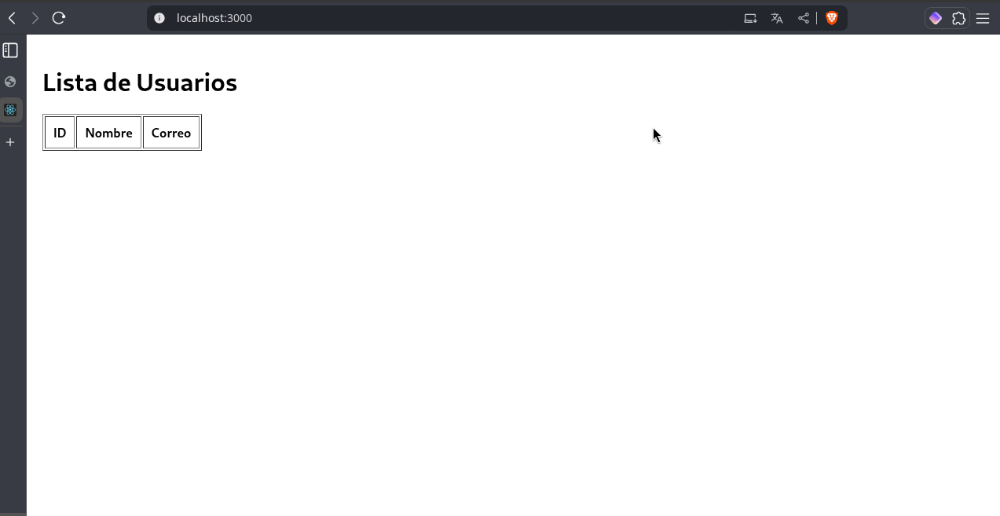
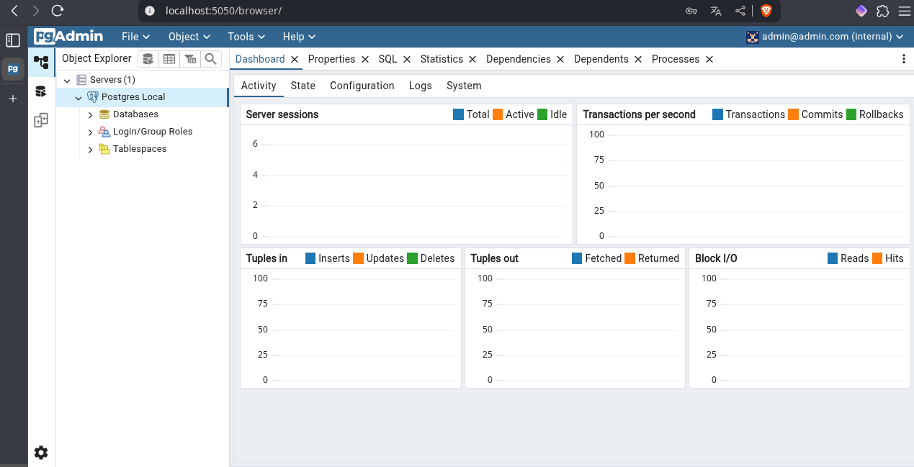

# Práctica: Despliegue de un Servidor Web con Docker y Docker Compose

## 1. Título

Implementación de un servidor web contenerizado con Nginx, Node.js y PostgreSQL usando Docker Compose

## 2. Tiempo de duración

180 minutos

## 3. Fundamentos

La contenerización es una técnica que permite empaquetar aplicaciones y sus dependencias en unidades portables llamadas contenedores. Docker es la herramienta más utilizada para crear, desplegar y ejecutar aplicaciones usando contenedores. Permite a los desarrolladores construir entornos de ejecución reproducibles, aislados y ligeros.

En esta práctica, se desplegó una arquitectura web que incluye tres componentes principales: un frontend desarrollado en React, un backend en Node.js y una base de datos PostgreSQL. Estos servicios fueron definidos y coordinados mediante Docker Compose, una herramienta que permite describir múltiples contenedores en un único archivo `docker-compose.yml`.


Cada servicio tiene su propio `Dockerfile`, donde se establece la lógica de construcción de su imagen. Además, se aplicó una técnica de build multietapa para optimizar el tamaño de la imagen del frontend.

## 4. Conocimientos previos

Para realizar esta práctica el estudiante necesita tener claros los siguientes temas:

- Comandos básicos de Linux
- Uso de Docker y Docker Compose
- Conceptos de contenedores e imágenes
- Manejo básico de PostgreSQL
- Conocimiento general de arquitectura cliente-servidor

## 5. Objetivos a alcanzar

- Implementar contenedores para un servidor web usando Docker y Docker Compose.
- Configurar correctamente la comunicación entre frontend, backend y base de datos.
- Utilizar archivos Dockerfile y `docker-compose.yml` con buenas prácticas.
- Aplicar builds multietapa para optimización de imágenes.

## 6. Equipo Utilizado**
- Computador con sistema operativo Linux (Fedora)
- MSI Nvidia 4060 16GB 512G
- Terminal de comandos (WARP)
- Conexion a Internet
- Navegar web conpatible (Zen browser u otros)
- Docker Engine versión 28.1.1
- Editor de texto (VS Code, nano, etc.)

## 7. Material de apoyo

- Documentación oficial de Docker: [https://docs.docker.com](https://docs.docker.com)
- Guía de la asignatura
- Docker Cheat Sheet
- PostgreSQL Documentation

## 8. Procedimiento

**Paso 1:** Crear la estructura de carpetas del proyecto `project-root/`, dividiendo en carpetas `frontend`, `backend`, y `db`.

**Paso 2:** Dentro de cada carpeta, agregar su respectivo `Dockerfile`. Por ejemplo, el del backend usa una imagen `node:alpine`, instala dependencias y expone el puerto 3000.

**Paso 3:** Crear un archivo `docker-compose.yml` donde se definan los tres servicios (`frontend`, `backend`, `db`) con sus respectivas configuraciones, redes y volúmenes.

**Paso 4:** Construir y levantar los contenedores con el comando:

```bash
docker compose up --build
```


**Figura 8-1. Contenedores levantados correctamente**

**Paso 5:** Verificar la conexión del navegador al frontend en `http://localhost`.

**Paso 6:** Comprobar que el backend está sirviendo datos desde PostgreSQL.

## 9. Resultados esperados

Al finalizar la práctica, se espera ver el siguiente resultado:

- El navegador debe cargar correctamente la interfaz web del frontend.
- El backend debe mostrar por consola que está escuchando en el puerto 3000.
- PostgreSQL debe iniciar y aceptar conexiones sin errores.



**Figura 9-1. Interfaz del frontend cargada**


**Figura 9-2. Logs de inicio del backend**



**Figura 9-3. PostgreSQL funcionando correctamente**

## Resumen en formato audio
[Escuchar resumen](https://drive.google.com/file/d/1MGejbUTe9aVjiD0iRKMKHC3viViZRD8m/view?usp=sharing)


## 10. Bibliografía

- Merkel, D. (2014). Docker: Lightweight Linux Containers for Consistent Development and Deployment. *Linux Journal*, 2014(239), 2.
- Docker Inc. (2024). *Docker Documentation*. Recuperado de https://docs.docker.com
- PostgreSQL Global Development Group. (2024). *PostgreSQL Documentation*. https://www.postgresql.org/docs/
