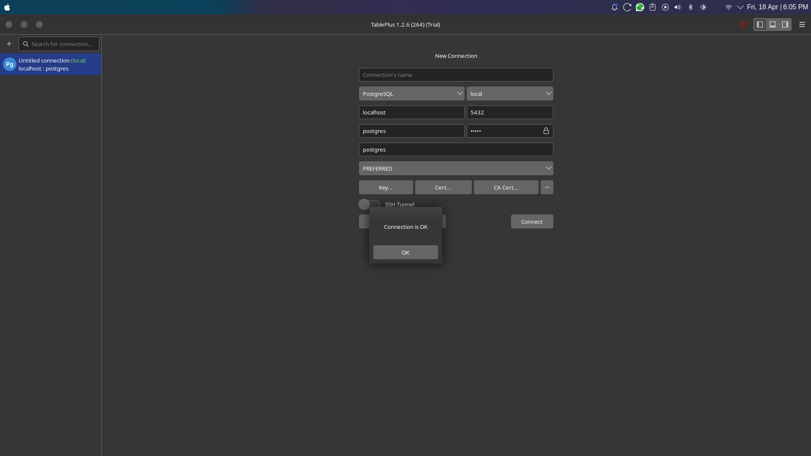
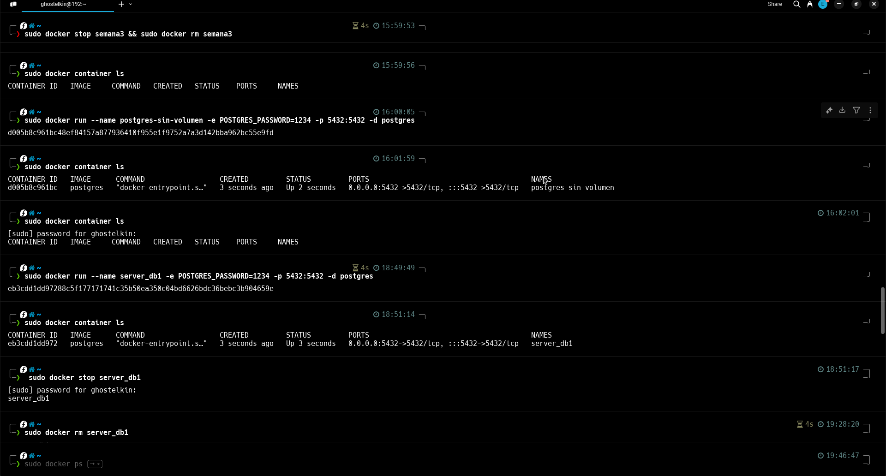

## 1.Titulo
Persistencia de Datos en Contenedores Docker con PostgreSQL

## 2.Duracion
110 minutos

## 3.Fundamentos
Un contenedor Docker es una unidad de software ligera y portable con todo lo necesario para poder ejecutar una aplicación: código, entorno de ejecución, bibliotecas y configuración.
#### Persistencia con volúmenes:
Un volumen de contenedor permite conservar los datos, aunque se elimine el Docker container. Los volúmenes también permiten un intercambio práctico de datos entre el host y el container.

#### PostgreSQL:
Sistema de gestión de bases de datos relacional (RDBMS) que utiliza contenedores para despliegues rápidos. Sin un volumen, los datos se pierden al reiniciar el contenedor.

### Arquitectura Docker con/sin Volúmenes


## 4. Conocimientos previos.
- Comandos básicos de Docker (run, stop, rm, volume).
- Conceptos de bases de datos (creación de tablas, inserción de datos).
- Uso de herramientas de administración como pgAdmin, Tableplus y Datagrip.
- Sintaxis SQL para PostgreSQL.

## 5. Objetivos a alcanzar
1. Mostrar la pérdida de datos en los contenedores sin aplicar volumenes.
2. Implementacion de volumenes en Docker teniendo la  persistencia de datos en PostgreSQL.
3. Verificar la recuperación dedatos en la base de datos después de eliminar y recrear contenedores.

## 6. Equipo necesario

- Computador con sistema operativo Linux (Fedora)
- MSI Nvidia 4060 16GB 512G
- Terminal de comandos (WARP)
- Conexion a Internet
- Navegar web conpatible (Zen browser)
- Herramienta gráfica (TablePLus).

## 7. Material de Apollo
- Documentacion oficial de Docker
- Guia de comando PostgreSQL
- Video tutorial de la Implementacion de Volúmenes en Docker
- Video tutorial del ING a Cargo

## 8. Proceso de creacion sin volumen
#### Base de datos sin volumen
### Paso 1: Crear el contenedor PostgreSQL (server_db1):
```bash
docker run --name server_db1 -e POSTGRES_PASSWORD=1234 -p 5432:5432 -d postgres
```


###  Conexión a la Base da datos TablePLus

### Paso 3: Crear base de datos test y tabla customer:
```bash
CREATE DATABASE test;
CREATE TABLE customer (id SERIAL PRIMARY KEY, fullname VARCHAR(100), status VARCHAR(50));
INSERT INTO customer (fullname, status) VALUES ('Elkin Carriel;', 'active');
```

### Creación de la base de datos y tabla.

### Paso 4: Detener y eliminar el contenedor:
```bash
docker stop server_db1
docker rm server_db1
```
### Paso 5: Recrear el contenedor (server_db1):
```bash
docker run --name server_db1 -e POSTGRES_PASSWORD=1234 -p 5432:5432 -d postgres
```
### Paso 6: Verificar que la base de datos test no existe:
Al conectarse nuevamente a la base de datos test  los datos se habrian perdido debido a que no se uso el volumen.


# Base de datos con volumen
### Paso 1: Crear un volumen de Docker:
```bash
docker volume create pgdata
```
### Paso 2: Crear el contenedor PostgreSQL (server_db2) con el volumen:
```bash
docker run --name server_db2 -e POSTGRES_PASSWORD=1234 -v pgdata:/var/lib/postgresql/data -p 5432:5432 -d postgres
```
### Paso 3: Crear la base de datos test, tabla customer e insertar datos:
```bash
CREATE DATABASE test;
CREATE TABLE customer (id SERIAL PRIMARY KEY, fullname VARCHAR(100), status VARCHAR(50));
INSERT INTO customer (fullname, status) VALUES ('Jane Smith', 'active');
```
### Paso 4: Detener y eliminar el contenedor:
```bash
docker stop server_db2
docker rm server_db2
```

### Paso 5: Recrear el contenedor usando el volumen pgdata:
```bash
docker run --name server_db2 -e POSTGRES_PASSWORD=1234 -v pgdata:/var/lib/postgresql/data -p 5432:5432 -d postgres
```

### Paso 6 Igreso nuevamente al la base de datos:
Al conectarse nuevamente, la base de datos test, la tabla customer y los registros estarán intactos debido a que se uso volumen.

 ### Base de datos intactos usando volumen.


## 7. Resultados esperados:
Los datos de la base de datos no se pierden al eliminar el contenedor.


## 8. Visualización de warp con todos los comandos utilizados en la práctica.


Durante el desarrollo de esta práctica, se logró evidenciar el comportamiento de la persistencia de datos en contenedores Docker, tanto al utilizar volúmenes como al prescindir de ellos. En el caso de los contenedores sin volúmenes, se observó que al detener y eliminar el contenedor, toda la información almacenada —incluyendo la base de datos test y la tabla customer— se pierde por completo. En contraste, al emplear volúmenes, se comprobó que los datos se conservan incluso después de reiniciar o recrear el contenedor, manteniendo intactos tanto la base de datos como los registros insertados. Esta experiencia permitió adquirir un conocimiento más sólido sobre el manejo de datos en entornos Docker y entender cómo los volúmenes actúan como una solución eficaz para asegurar la permanencia de la información.

[Escuchar resumen]
 - Formato Audio
 (https://drive.google.com/file/d/1XgCR39nl4LWsk6MAYqM2-lq59OytGKBG/view?usp=drive_link)


## 10. Bibliografía

 Docker Inc. (2023). Docker Documentation. Recuperado dehttps://www.ionos.com/es-us/digitalguide/servidores/know-how/docker-container-volumes/

 Docker con y sin volumen https://somospnt.com/blog/252-como-puedo-crear-un-volumen-en-docker

 PostgreSQL Global Development Group (2023). PostgreSQL 15 Documentation. Recuperado de https://www.postgresql.org/docs/15/.
